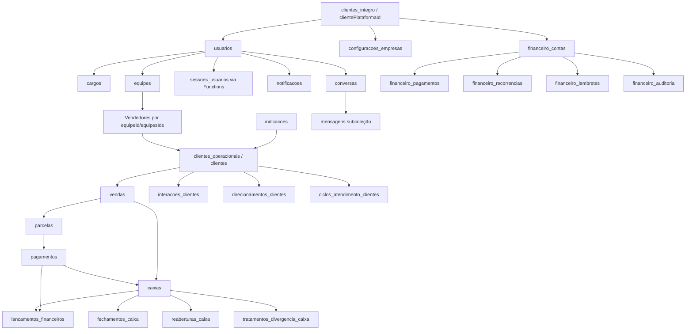

# MAPA DE DADOS - ÍNTEGRO

Gerado em: 2026-08-25

## Relações confirmadas no código

## Fluxos de contrato

| Fluxo | Escrita principal | Leituras derivadas | Observação |
|---|---|---|---|
| Lead para cliente | indicacoes, clientes_operacionais | vendedor/supervisor/captador | Conversão atualiza indicação quando cliente vira venda. |
| Venda | vendas, parcelas, clientes, caixas, lancamentos_financeiros, logs | cobrança, dashboard, caixa, financeiro operacional | Transacional via Function quando disponível. |
| Pagamento | pagamentos, parcelas, vendas, clientes, caixas, lancamentos_financeiros, logs | cobrança, caixa, dashboard, ledger | Idempotência por ID determinístico. |
| Não pagamento | historicoCobrancas | fechamento/carteira | Incompatível com Rules atuais; precisa backend. |
| Sessão | sessoes_usuarios | auth guard | Backend-only via Functions. |
| Financeiro empresarial | financeiro_contas/pagamentos/categorias/centros/etc. | relatórios e auditoria financeira | Independente do caixa operacional. |
| Chat | conversas + mensagens | badge e chat-ui | Regras controlam participantes e tipo. |

## Aliases de dados críticos

| Conceito | Campos encontrados | Recomendação |
|---|---|---|
| Tenant | clientePlataformaId, tenantId, empresaId | Padronizar clientePlataformaId e manter aliases só em migração. |
| Usuário Auth | authUid, uid, id documento | Documento canônico deve ser usuarios/{authUid}. |
| Vendedor responsável | vendedorId, vendedorAuthUid, vendedorUid, responsavelId, usuarioId | Manter vendedorAuthUid como chave operacional principal. |
| Saldo cliente | saldoDevedorCentavos, saldoDevedor, saldoAtual, saldo | Usar centavos como fonte da verdade. |
| Data operacional | dataOperacional, data, dataVenda, criadoEmTexto, criadoEm | Usar helper São Paulo para regras de caixa/cobrança. |
